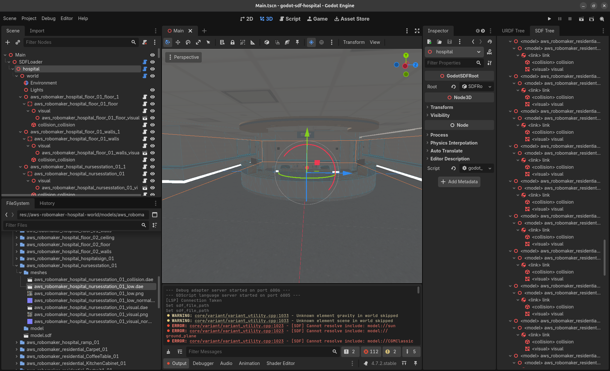

# AWS Robotics Hospital environment in Godot
Just checkout the repository with all its submodules and open it in Godot 4.7+.

## Architecture
The SDF-parsing part always follows the same pattern, first we generate a data structure for each element in the `parse(parser: SDFParser)`-function. This structure then gets hand over to the GodotSDFRoot that creates Godot Node3D-based elements from the sdf_godot folder using the `to_godot(...)`-function.

## AI Usage
As the parser always follows the same pattern and SDF is strictly defined in sdformat.org Anthropics Claude has been used to generate parts of the code.

## Screenshot
